|  |  |  |    
| :-: | :-: | :-: |     

# Setting up a sensor network with Meshtastic

While [Meshtastic](https://meshtastic.org) is known as a communication tool to send messages over a LoRa based mesh network, it has as well built-in functions to read sensors and share the sensor values.    

What we want to show in this proof of concept is a scenario where multiple sensor nodes can connect over the mesh network to a "gateway" which transmits the sensor data to a MQTT broker.    
From the MQTT broker, the data is retrieved via a NodeRED flow and send to an InfluxDB database.    
For visualization, the InfluxDB database is connected to an Grafana instance.    

<center>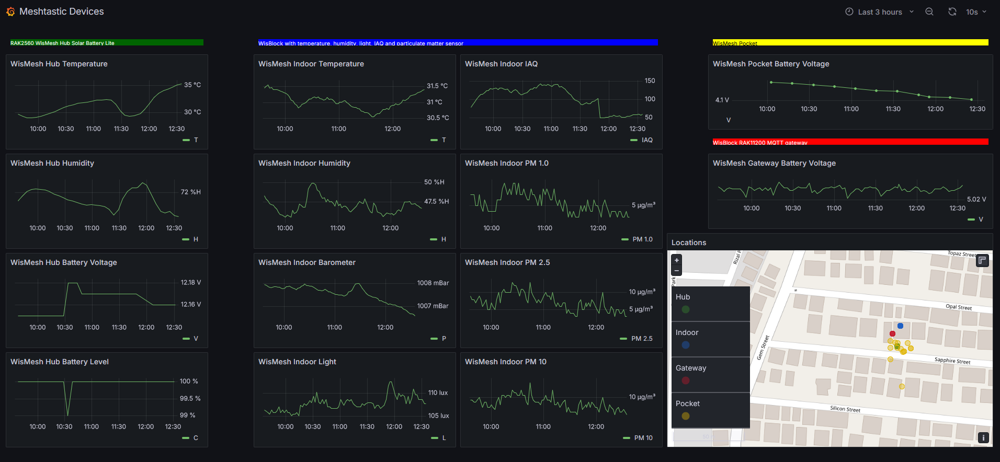</center>

----

For this PoC, we connect four meshtastic devices to each other.

- [Gateway based on RAK11200](https://docs.rakwireless.com/Product-Categories/WisBlock/RAK11200/Overview/) as gateway to an MQTT broker with a [RAK13300](https://docs.rakwireless.com/Product-Categories/WisBlock/RAK13300/Overview/) for the Meshtastic connection    
- WisMesh Hub [RAK2560](https://docs.rakwireless.com/Product-Categories/Meshtastic/WisMesh-Hub/Overview/) (soon to come) as a range extender with integrated temperature and humidity sensor. This node is powered by a [RAK9154](https://docs.rakwireless.com/Product-Categories/Accessories/RAK9154/Overview/) solar panel and battery kit.    
- [WisMesh Pocket](https://docs.rakwireless.com/Product-Categories/Meshtastic/WisMesh-Pocket/Overview/) without sensors, only transmitting its locations    
- [Sensor node based on RAK4631](https://docs.rakwireless.com/Product-Categories/WisBlock/RAK4631/Overview/) on a [RAK19001](https://docs.rakwireless.com/Product-Categories/WisBlock/RAK19001/Overview/) Base Board as an environment sensor node with a light sensor [RAK1903](https://docs.rakwireless.com/Product-Categories/WisBlock/RAK1903/Overview/), a temperature, humidity and air quality sensor [RAK1906](https://docs.rakwireless.com/Product-Categories/WisBlock/RAK1906/Overview/) and a particulate matter sensor [RAK12039](https://docs.rakwireless.com/Product-Categories/WisBlock/RAK12039/Overview/)

----

# Firmware

All above listed devices running the "standard" Meshtastic firmware with one exception.    
The RAK11200 is running a "bug-fixed" version of the Meshtastic firmware. 
> _**While setting up the device I found two problems with the data sent to the MQTT broker.**_        
> 
> _(1) When using protobuf packets, the IAQ level of the RAK1906 could not be found by the [NodeRED Meshtastic decoder](https://flows.nodered.org/node/@meshtastic/node-red-contrib-meshtastic)_    
> _(2) When using JSON formatted packets, the sensor data of the particulate matter sensor was not included in the data sent to the MQTT broker._    

As in this PoC the JSON formatted data is used (easier to handle in NodeRED), the problem with the JSON formatted data was fixed in the Meshtastic sources and a custom version was compiled for the RAK11200. The required changes are reported in Meshtastic Github as [issue #4390](https://github.com/meshtastic/firmware/issues/4390).    

----

# Setup of the devices

As mentioned, the devices are flashed with "standard" Meshtastic firmware. The difference between the devices is in the setup.     

The setup of each device is done with the Meshtastic mobile application (here the Android version was used). Alternative the setup could be done with the Meshtastic WebUI or the Meshtastic command line tool.    

In the Meshtastic app, in the first step, all devices should be connected to the app:

<center>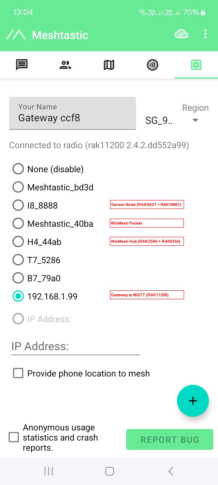</center>

### ⚠️ IMPORTANT    
All devices have of course to be set to the same _**Region**_. My country is not listed (yet), the closest frequency selection (to avoid illegal usage of frequencies) is _**SG_923**_ 

---- 

## All devices - Location settings

From the four devices used in the PoC, only the WisMesh Pocket has a GNSS location module. 

To still be able to see the device locations in the map, these devices are set to report a fixed location.    

### Location setup of the WisMesh Pocket

For this device, the location allocation is enabled in the settings to report the actual location of the device:

<center>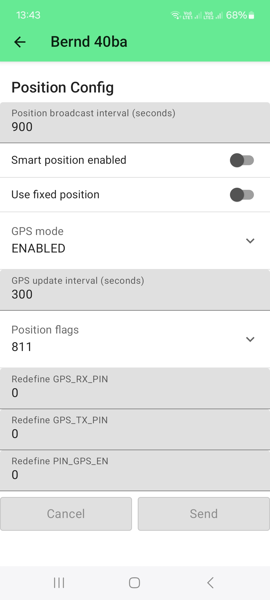</center>

### Location setup for the WisMesh Hub, the sensor node and the gateway node

For these devices, the fixed location setting is enabled and the latitude and longitude is entered manually:

<center>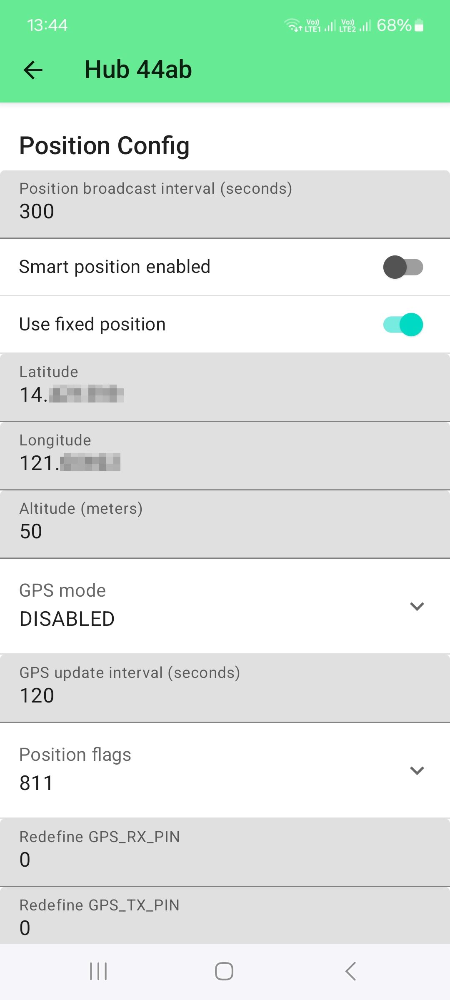</center>


----

## The gateway RAK11200

The gateway has to be connected to the internet. In this case, as we are using the RAK11200 with its built-in WiFi.    
Alternative the gateway could be setup with another WisBlock Core module (like the RAK4631 or RAK11310) and the ethernet module [RAK13800](https://docs.rakwireless.com/Product-Categories/WisBlock/RAK13800/Overview/) to connect to a wired network.

<center>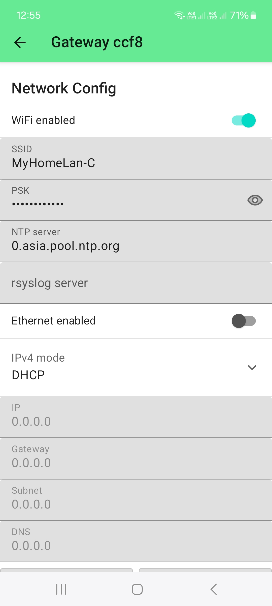</center>

### ⚠️ IMPORTANT  
For this setup, we connect to the device first over BLE and setup the WiFi credentials.    
Alternative the connection settings can be done with the Meshtastic App or over USB and the Meshtastic Web GUI or command line utility.    
Once the device has connected to the WiFi network, it is shown with it's IP address in the device list.    

The next step is to setup the connection to the MQTT broker. Here we use the free MQTT broker provided by Meshtastic:

<center>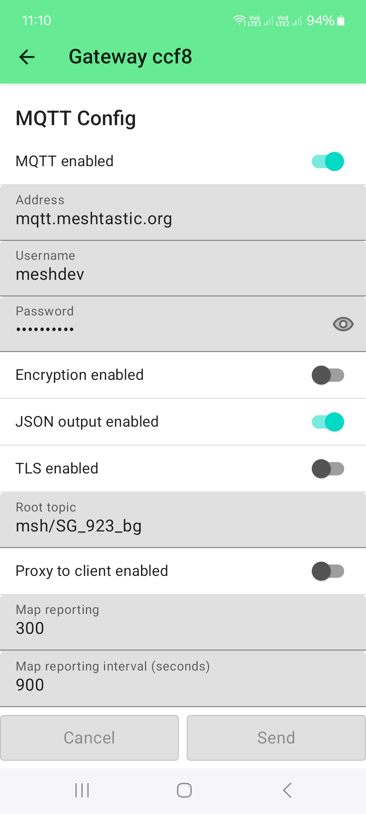</center>

### ⚠️ INFORMATION    
- The MQTT broker used here is the free MQTT broker provided by Meshtastic. You can find the URL, address, username and password in the [Meshtastic documentation](https://meshtastic.org/docs)    
- As we will setup NodeRED to parse the JSON packets, the JSON output must be enabled.     
- To avoid too much traffic, a custom root topic is created. If one of the already existing topics are used, it is more effort to filter out our devices later in NodeRED.        
- If it is desired to see the devices on the public Meshtastic maps, e.g. [MeshMap.net](https://meshmap.net/), the Map reporting has to be enabled and a reporting time has to be set.    

----

## The sensor node (RAK4631 + RAk19001 + sensor modules)

As this node is only communicating over LoRa, the required setup is focused on the _**Telemetry Config**_:

Meshtastic is sending the environment sensor data and the particle matter sensor data through two different metrics, the _**Environement metrics**_ and the _**Air quality metrics**_. So both of them have to be enabled.    

<center>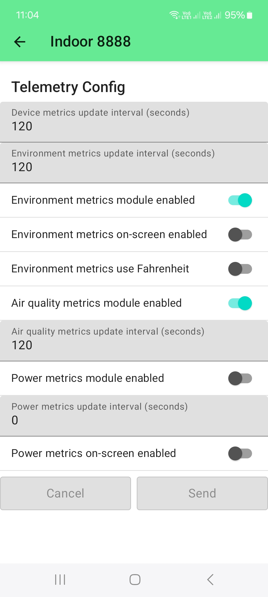</center>

----

## The repeater node WisMesh Hub

This device is designed as a repeater or hub to extend the coverage of the Meshtastic network. Usually this device would not have any sensors, it will report only its battery status.    
For this PoC, the WisMesh Hub was equipped with a temperature and humidity sensor [RAK1901](https://docs.rakwireless.com/Product-Categories/WisBlock/RAK1901/Overview/).    

To see these sensor values, the setup is similar to the sensor node, only in the _**Telemetric Config**_ only the _**Environment metrics**_ is enabled. The _**Air quality metrics**_ is not required.

<center>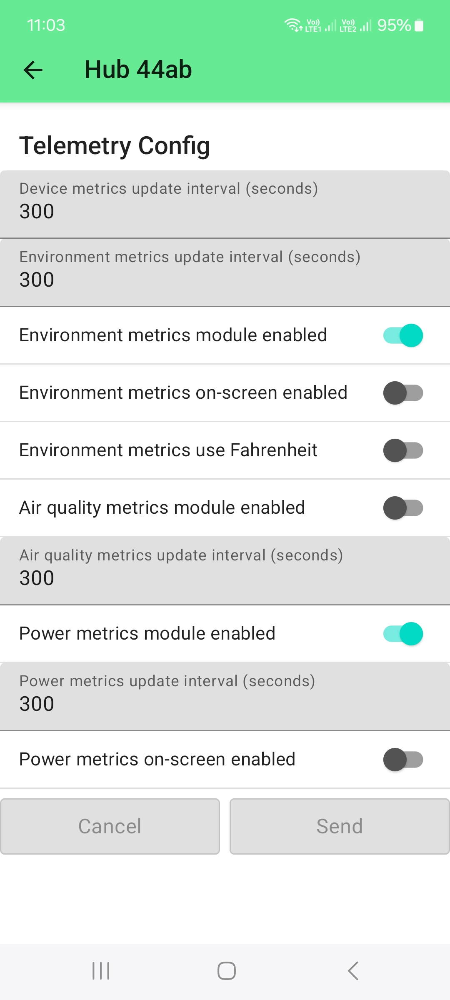</center>

### ⚠️ INFORMATION    
The _**Power metrics**_ are shown enabled, but it is not necessary to do so. The WisMesh Hub will report it's battery status through the _**Environment metrics**_

----

## The WisMesh Pocket

As this device does not have any sensors, only its GNSS location module, no further setup is required.

----

# The used hardware

All devices are based on WisBlock. The WisMesh Hub (coming soon) and the WisMesh Pocket are ready to use devices that can be bought directly from the [RAKwireless Store](https://store.rakwireless.com/collections/meshtastic).

The sensor node is built with
- [RAK4631](https://docs.rakwireless.com/Product-Categories/WisBlock/RAK4631/Overview/) Core module flashed with Meshtastic firmware. 
- [RAK19001](https://docs.rakwireless.com/Product-Categories/WisBlock/RAK19001/Overview/) Base Board
- [RAK1903](https://docs.rakwireless.com/Product-Categories/WisBlock/RAK1903/Overview/)  light sensor
- [RAK1906](https://docs.rakwireless.com/Product-Categories/WisBlock/RAK1906/Overview/) environment sensor
- [RAK12039](https://docs.rakwireless.com/Product-Categories/WisBlock/RAK12039/Overview/) particulate matter sensor

The gateway node is built with
- [RAK11200](https://docs.rakwireless.com/Product-Categories/WisBlock/RAK11200/Overview/) Core module flashed with Meshtastic firmware. 
- [RAK19007](https://docs.rakwireless.com/Product-Categories/WisBlock/RAK19007/Overview/) Base Board
- [RAK13300](https://docs.rakwireless.com/Product-Categories/WisBlock/RAK13300/Overview/)  LoRa module

----

# Getting the data from the Meshtastic MQTT Broker

Once the hardware is setup and running, the data of the devices can be seen in the Meshtastic MQTT Broker.    
I used the [MQTT-Explorer](https://thomasnordquist.github.io/MQTT-Explorer/) to connect to the broker.

<center>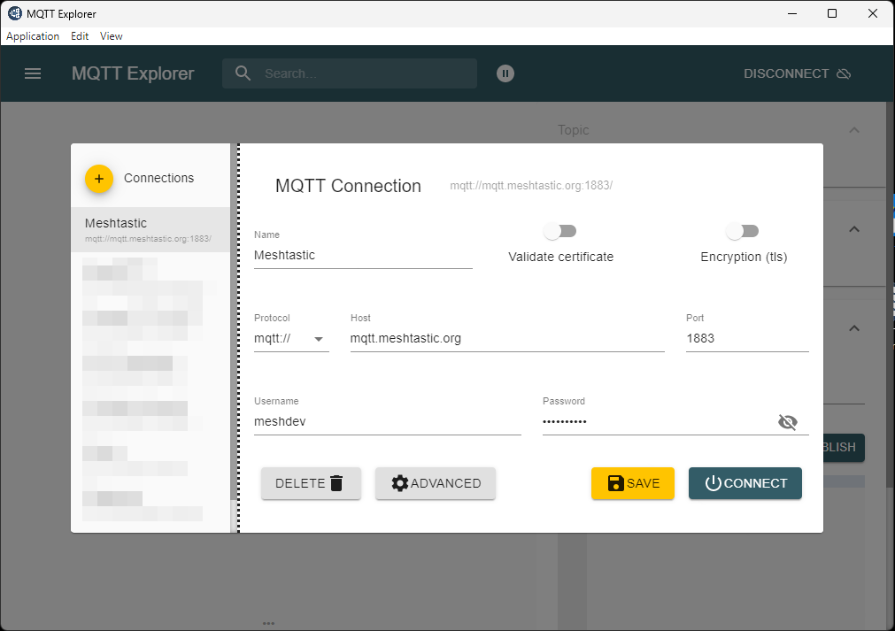</center>

To limit the number of data shown, I subscribe only to my topic _**msh/SG_923_bg**_.

<center>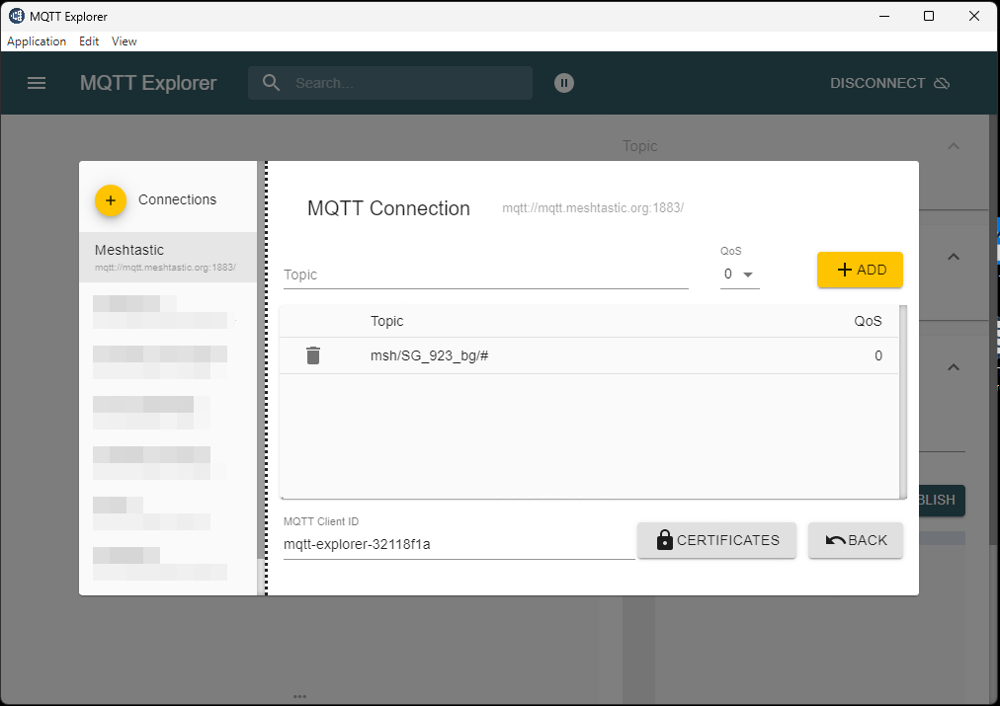</center>

After connecting, I can see the messages coming in from the Meshtastic gateway.

<center>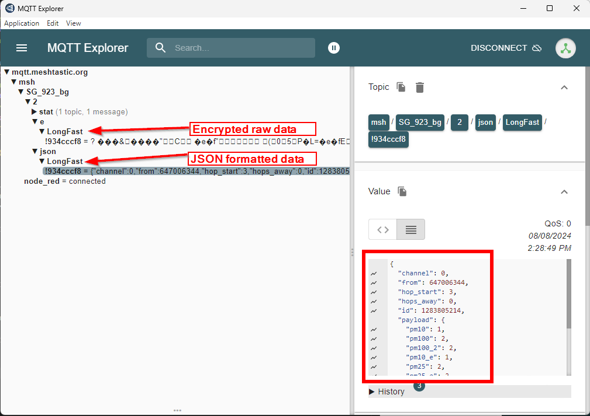</center>

----

# Setup the cloud based back-end for the data

To process the data and visualize it, NodeRED, InfluxDB and Grafana are used.    
This readme does not cover the installation and setup of these applications. It is assumed that they are already up and running.    

Of course any other combination of applications can be used, e.g. Python scripts.    

----

# NodeRED to collect the data from the broker and send them into the database

With only four nodes the Meshtastic node data is received, parsed and forwarded to the database:

<center>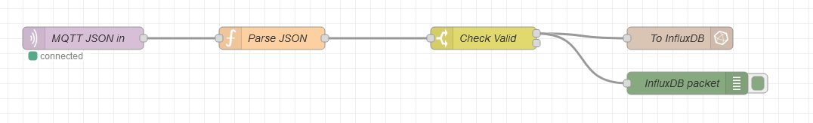</center>

----

## MQTT JSON in

This node is connecting to the MQTT Broker and subscribing to topics.    
It is a "standard" node available in NodeRED.    
The setup is in two steps:

### MQTT broker

First the connection to the MQTT broker has to be setup. Place the node in the flow, then double click to open its settings.    
In the first settings screen, click on the edit icon and create a new connection:

<center>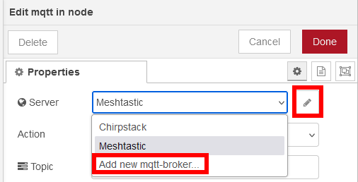</center>

In the next window, add the MQTT broker information, this has to be the same Broker that is used in the Meshtastic gateway. Set the URL in the _**Connection**_ tab, the username and password in the _**Security**_ tab and the connection/disconnection messages in the _**Messages**_ tab.

<center>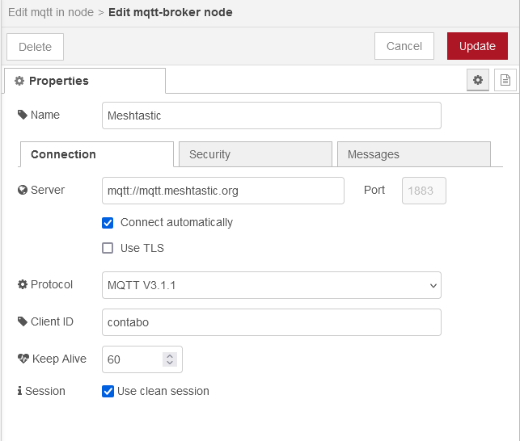</center>

After updating the connection settings, enter the topic we are interested in and subscribe to a single topic. Select _**auto-detect**_ as Output.

<center>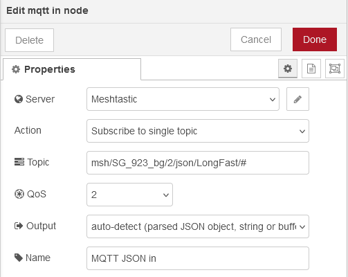</center>

----

## Parse JSON

This node is a function node that is parsing the incoming data to 
- check which node the data is coming from
- whether the data is telemetry, power information, air quality data or location data.
- Create the message to be sent to the InfluxDB database
- Create a flag if the data should be sent to the database or discarded.

### ⚠️ INFORMATION    
The code for this node can be found in [mqtt-in.js](./mqtt-in.js).    
The part that needs to be edited for different devices is the first check, which node the data is coming from:

```js
// Check where the data is coming from
if (msg.payload.from == 1129595066) {
	node_id = 'pocket';
} else if (msg.payload.from == 436487339) {
	node_id = 'hub';
} else if (msg.payload.from == 647006344) {
	node_id = 'ind';
} else if (msg.payload.from == 2471283960) {
	node_id = 'gw';
} else {
	node_id = msg.payload.from.toString();
}
```

This turned out to be a little bit difficult, because the JSON payload did not include the device names. Instead it has the node ID, but it is shown as decimal value. The node ID is not shown in the Meshtastic mobile app, only the node name. So it took some detective work to find out which data is coming from which node and place the node ID into the Java script code.    

The node_id set in this code part is later used in Grafana to get the data from the different nodes for visualization.

----

## Check Valid

This is a simple switch node. If the incoming data is of interest (valid), it will forward them to InfluxDB. Otherwise the data is discarded.

<center>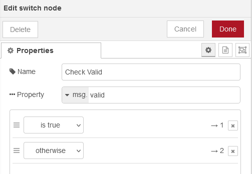</center>

### ⚠️ INFORMATION    
The complete NodeRED flow with all nodes can be found in [nodered-flow.js](.\nodered-flow.js)

----

## To InfluxDB

This node has to be installed separate. It is from the `node-red-contrib-influxdb` palette. You need to install it in NodeRED through `Manage Palette`.     

Here the `influx_batch_ node is used to send multiple data together with a timestamp to the database.    

Similar to the MQTT broker setup, first the connection to the InfluxDB database has to be setup. After placing the node in the flow, double click it to open the settings. Choose the edit icon to add a new database connection:

<center>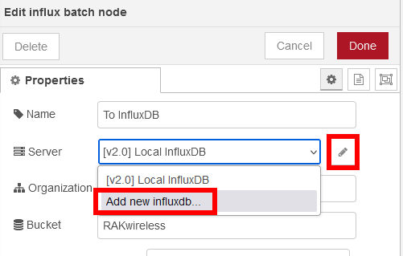</center>

Then enter the connection information for the InfluxDB database

<center>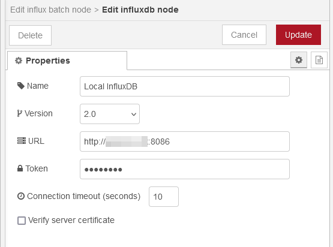</center>

- Choose the correct version of the database
- Set the URL to the database
- If InflxuDB V2, you need to create a token in the database that allows to push data to it. Enter this toke in the `Token` field

Once the connection is saved, enter the `Organization` and the `Bucket` name. You need to create these in InfluxDB V2 as well.

<center>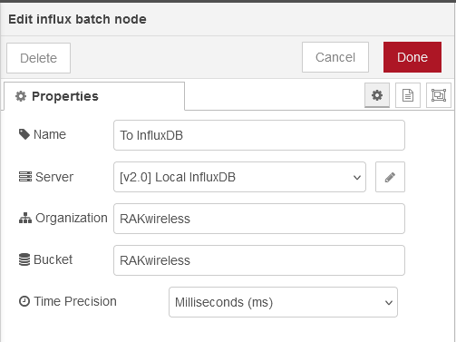</center>

If everything is setup correct and the flow is deployed, the parsed data is shown in the debug output created by `InfluxDB packet`

<center>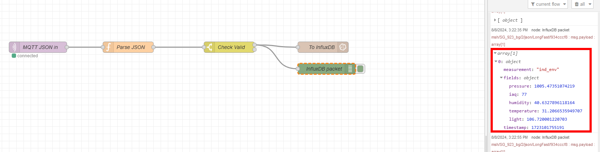</center>


----

# Check data in influxDB

In influxDB you can use the `Data Explorer` to see the incoming data

<center>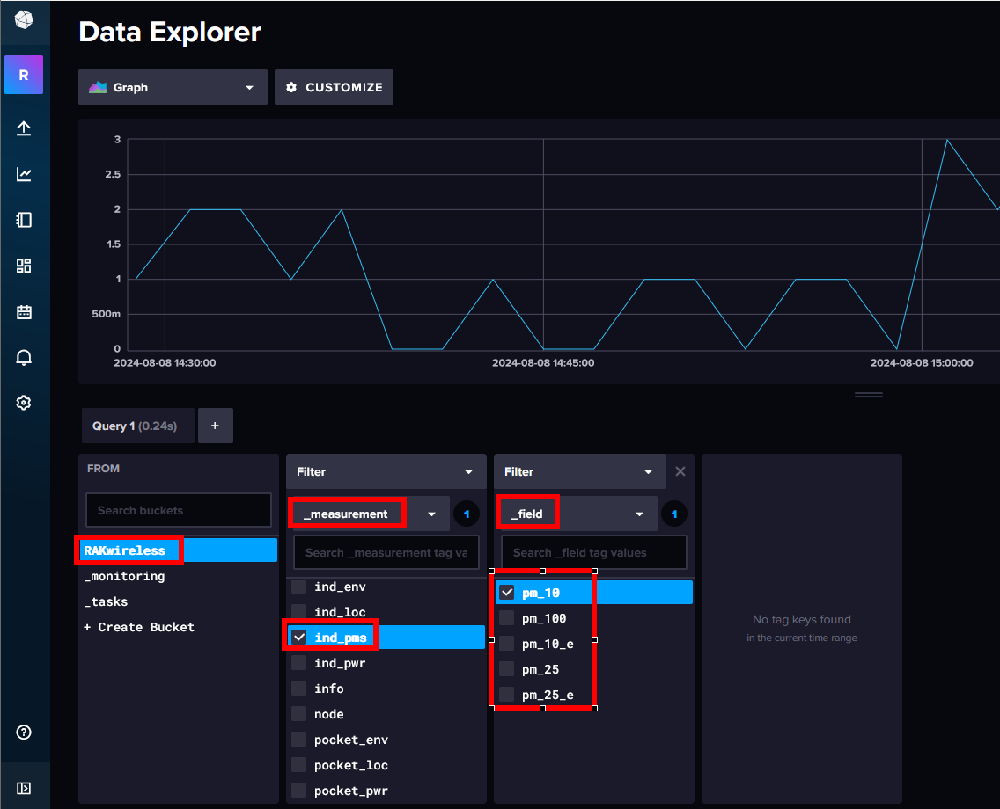</center>

You can see in the first filter in the `_measurement`, the node names we assigned before in the NodeRED flow.    
The second filter shows the sensor data.

The Data Explorer can be used as well to create the data query in the form we need later in Grafana to pull the data from the database. Click on the `Script Editor` button

<center></center>

It will show now the query we need for Grafana

<center>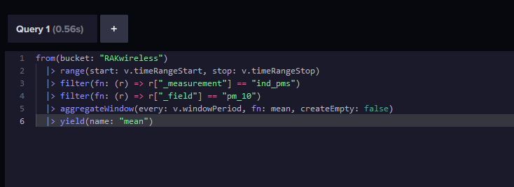</center>

----

# Visualize the data in Grafana

This tutorial is not covering the installation of Grafana and how to setup a connection to the influxDB database. It is assumed that this is already done.

In Grafana, create a new Dashboard and add a visualization.

<center>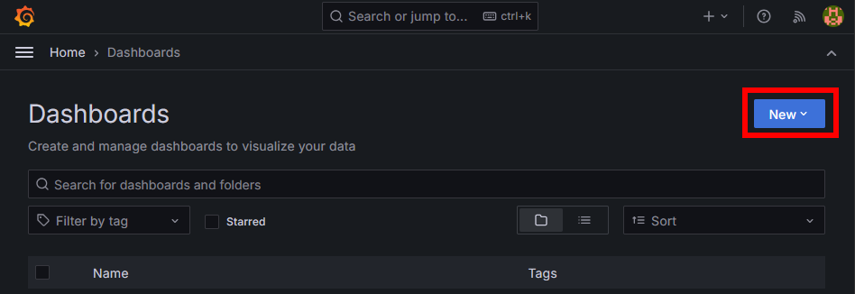</center>

Once the new dashboard is open, add a visualization.

<center>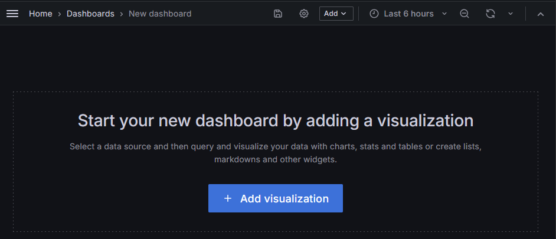</center>

Add the data source

<center>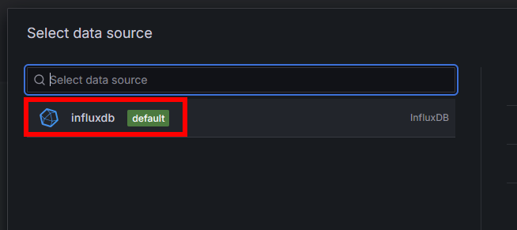</center>

Then copy the query created in influxDB into the query field and push the refresh button to see the data

<center>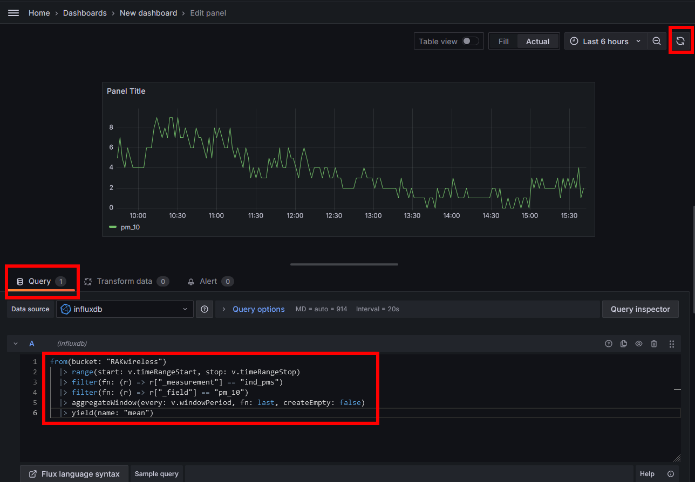</center>

This has to be repeated for each single data you want to show in the dashboard.

The result could look like my dashboard (or different, depending on your sensors and your personal preferences)

<center></center>


A (for some time available) live link to my setup can be seen on [Meshtastic Devices](http://giesecke.tk:3000/public-dashboards/2e6481c840c145f78128b2da794087a1?orgId=1&refresh=10s&from=now-3h&to=now)
