|  |  |  |    
| :-: | :-: | :-: |     

# WisMesh Basic Device Setup Guide

This guide goes step by step through the setup of a WisMesh device based on the RAKwireless RAK4631 (nRF52840), RAK11200 (ESP32) or RAK11310 (RP2040) module.    

⚠️ The Meshtastic mobile app used is the Android version. The steps will be similar when using the iOS version of the application, however the UI will be looking different.

This guide is for the basic device setup and is divided into three sections:     
- (1) General setup of a device with the RAK4631 (nRF52840) module and the  the RAK11200 (ESP32) module with the Meshtastic mobile app over BLE
- (2) WiFi connection setup of a device with the RAK11200 (ESP32) module with the Meshtastic mobile app over BLE and WiFi
- (3) General setup of a device with the RAK11310 (RP2040) with the Meshtastic Web Client

It covers the setup of the device to send and receive messages over the Meshtastic Network and the setup of the location acquisition module (if available).

⚠️ A detailed extended setup guide for Meshtastic Sensors, is in the [WisMesh-Sensor-Node-Setup](./README.md) guide, which shows additional steps required to forward sensor data to a MQTT broker and visualize them in the Cloud.
The WisMesh-Sensor-Node-Setup goes through the steps to enable sensor data transmission for devices with additional sensors, like temperature, humidity, air quality and other sensors.

⚠️ A detailed extended setup guide how to setup a Meshtastic device as gateway to a MQTT broker is in the [WisMesh-Gateway-Setup]() guide, which covers the setup of a Ethernet or WiFi connection to a MQTT broker to forward sensor data, device location and other information to the Cloud.

----

## Setup a WisMesh device with RAK4631 or RAK11200 over BLE

### Connect the device to a mobile phone over BLE

⚠️ The Meshtastic Mobile app uses BLE to communicate with the WisMesh device. To be able to use the app, your mobile phone must support BLE communication.    

----

**(1) Install the Meshtastic Mobile app from [Google Play Store](https://play.google.com/store/apps/details?id=com.geeksville.mesh) or [Apple App Store](https://apple.co/3Auysep).**

⚠️ For Android devices other options to install the application are available. Details are shown in the [Meshtastic Software](https://meshtastic.org/docs/software/) documentation.

⚠️ After installation, on the first start of the application it will ask for multiple permissions.    
_**Make sure to allow all requested permissions, otherwise the application will not be able to communicate with the WisMesh device**_

----

**(2) Connect a WisMesh device to the mobile applicaiton**

1) Make sure that BLE is enabled on the mobile phone

2) In the Meshtastic app, use the (+) button on the lower right side to start connecting to a device.
<center>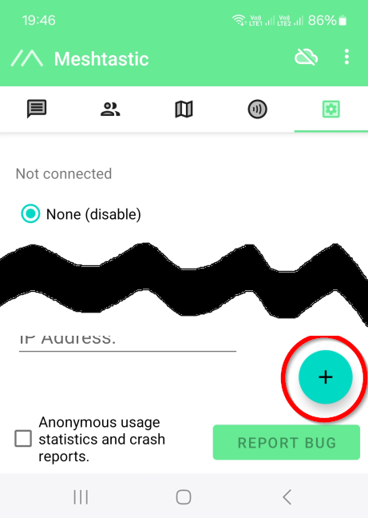</center>    

3) The device will now show available BLE devices in a list:
There might be multiple entries listed, all of them are devices with the Meshtastic firmware.     
<center>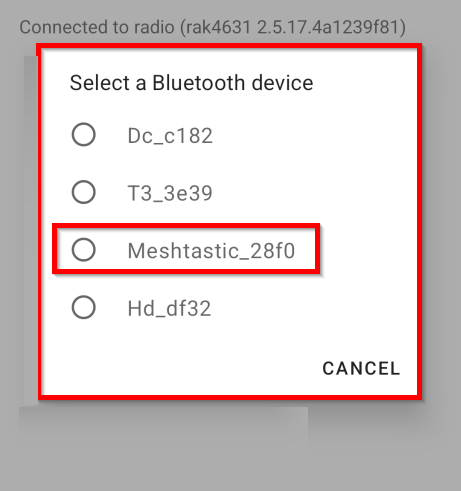</center>     
If your device has a display (like the WisMesh B1), you can see its name in the display.
<center>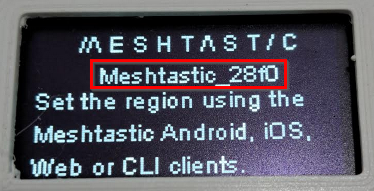</center>     

Select the device you want to add. It will ask for a Bluetooth pairing PIN.    
<center>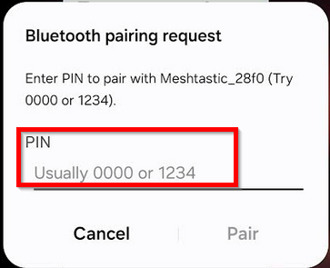</center>     
If your device has a display (like the WisMesh B1), you can see the PIN in the display.
<center>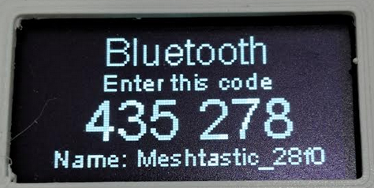</center>      

If your device doesn't have a display, try the PIN _**123456**_.      

⚠️ If _**123456**_ doesn't work as PIN, you will have to connect to the device over USB, and use a Serial Terminal application to check the debug output of the device. The PIN number required for the BLE connection will be shown in the debug output.    

The device will now show up in the device list of the mobile app.

<center>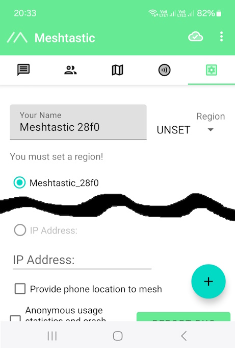</center>  

----

### Setup the connection parameters of the device

#### Setup the Meshtastic Region    
The first thing to setup is the Meshtastic Region. This is done in the Region selector on the right side.

<center>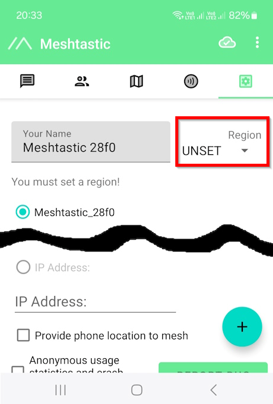</center>  

On a new device, it will show _**UNSET**_. On the drop-down selector you have to choose the correct Meshtastic region for your country.     

<center>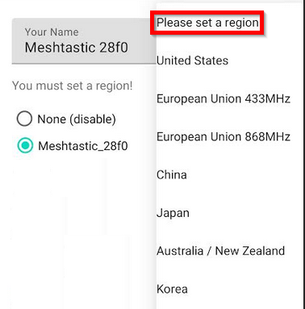</center>  

⚠️ It is necessary to select the correct Meshtastic Region, otherwise the WisMesh device will not be able to connect to other Meshtastic nodes! The region defines the basic LoRa frequency range the device will use to communicate.    

If you are unsure about the correct region for your country, you can find a list in the [Meshtastic documentation => Region](https://meshtastic.org/docs/configuration/radio/lora/#region)    

----

#### Open the Radio Configuration    
To continue with the setup, we have to open the _**Radio Configuration**_.     
To open the _**Radio Configuration**_ click on the three dots on the top right side. A menu will open, showing different options, including the _**Radio Configuration**_.      

<center>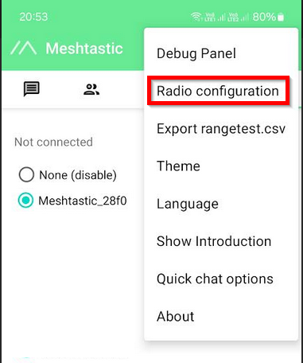</center>  

In the next steps, we will check the (1) _**Channels**_ settings, the (2) _**LoRa**_ settings, enable the (3) _**Location**_ tracking and correct the (4) _**Display**_ setting if needed.

<center>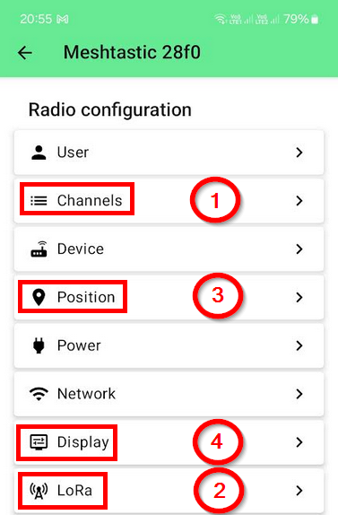</center>  

----

#### Setup the communication channel    
The default primary channel for communication is preset in the device to _**LONGFAST**_. However, if you do not want to share your communication with all other Meshtastic devices, you can change it in the _**Channels**_ setting and define your own communication channel.     

⚠️ _For most users, the default channel setting will work._     

As an example, here is the setup for a "private" channel, that the devices in the [Meshtastic Sensor Network](https://github.com/beegee-tokyo/Meshtastic-Sensor-Network) are using.

In the _**Channels**_ settings, click on the default channel _**LONGFAST**_. This will open a new window, where we can define a new channel name and assign our own PSK for the encryption.    

<center>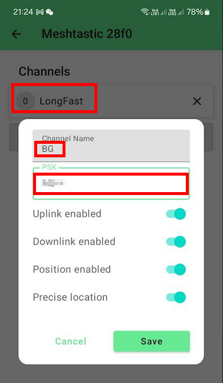</center>      
<sup>Any similarity of the channel name with the writer of this document is coincidence</sup>     

⚠️ All devices in this "private" device group have to use the same channel name _**AND**_ the same PSK to be able to communicate!

----

#### Setup the LoRa configuration     
After selecting the _**Meshtastic Region**_, the LoRa communication is preset to an default for this specific region.     

⚠️ _For most users, the default LoRa setting will work._     

Using again the "private" Meshtastic network that the devices in the [Meshtastic Sensor Network](https://github.com/beegee-tokyo/Meshtastic-Sensor-Network) are using, the default settings for _**Modem preset**_ and _**Frequency Slot**_ are changed from the defaults _**LONG_FAST**_ and _**3**_ to _**SHORT_FAST**_ and _**2**_ to match with the other devices.    

<center>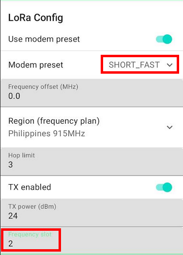</center>      

⚠️ All devices in this "private" device group have to use the same _**Modem preset, LoRa frequency offset and the same Frequency Slot**_ to be able to communicate!

**Advanced user settings**    
Another setting in the _**LoRa Config**_ that will be important if the devices messages and sensor data should be shared over a MQTT broker to the Cloud, is at the very end of the screen.    
Scrolling down, it shows two settings related to MQTT.

<center>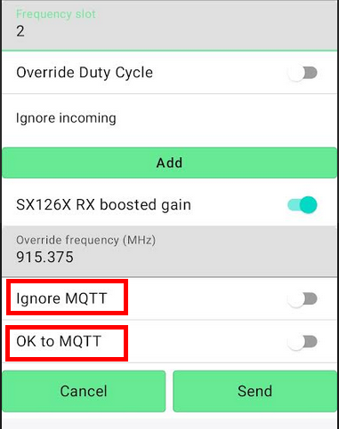</center>      

Enabling _**Ignore MQTT**_ will ignore messages that are received from a MQTT broker.    
Enabling _**OK to MQTT**_ MUST be set, if the device's data should be sent to a MQTT broker. This is an important setting if e.g. sensor data or location data are shared with the Cloud for further processing.    

----

## Setup the WiFi connection of the RAK11200

⚠️ Part 1 of the setup is identical for a RAK4631 and a RAK11200. In part 2, the WiFi connection of the RAK11200 will be setup.    
Once the WiFi connection is established, and the RAK11200 is connected to the same WiFi network as the mobile phone, the device will show up with it's WiFi connection in the mobile app!

----

### Setup the WiFi credentials in the Radio Configuration
Follow the steps of Part 1 to connect the RAK11200 to the Meshtastic Mobile app.    

Goto to the _**Radio Configuration**_.    
To open the _**Radio Configuration**_ click on the three dots on the top right side. A menu will open, showing different options, including the _**Radio Configuration**_.      

<center></center>  

In the different options showing in the _**Radio Configuration**_ choose _**Network**_

<center>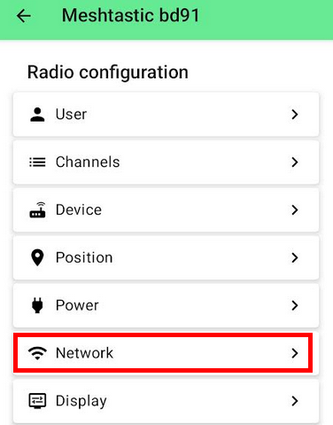</center>  

The _**Network Config**_ is for both WiFi and a wired connection through Ethernet. Enable WiFi and keep Ethernet disabled.    

Then enter the WiFi SSID that should be used and the WiFi PSK for this WiFi Network. Optional (if available), you can scan a QR code with the WiFi credentials.    

<center>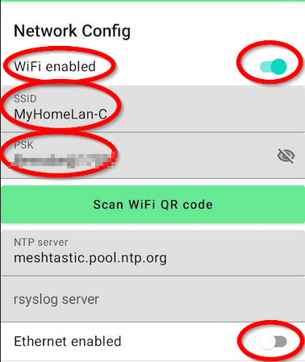</center>  

⚠️ The settings for the NTP server (Network Time Provider) are optional. You can use the default **meshtastic.pool.ntp.org** or choose one that works better for your country.

Once the Meshtastic node is connected to the WiFi network, the BLE connection to the Meshtastic Mobile app is no longer available. 

# ⚠️ WARNING
_**If you configure the device for a WiFi network that you cannot access from your phone, e.g. an isolated guest access point on your router, you cannot access the device anymore. The only way to recover the device is to do a factory reset by reflashing the Meshtastic firmware**_

----

### Connect to the device via WiFi     
Connect your phone to the same WiFi network that is setup in the _**Network Config**_ of the device.     
The device will show up in the device list with its IP address now.

<center>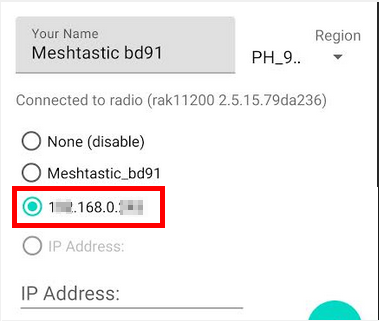</center> 

If the device is not showing in the list, you can try to obtain the IP address of the device 
- from the USB log output 
- with a network scanner application

Once you have the IP address, you can enter it in the _**IP Address:**_ field and try to connect.    

⚠️ If the device is not showing up with its IP address and the manual entry of the IP address does not work either you might have selected a WiFi network that you cannot access from your phone.    
Connect the phone to the same WiFi network and check if it is listed.     
If this doesn't work as well, you might need to reset the device by doing a factory reset.    

----

## Setup a WisMesh device with RAK11310 through the Web Client

The Raspberry RP2040 MCU on the RAK11310 does not have WiFi nor BLE connectivity. The only way to setup the device is through the Web Client.    

----

### Connect the device over USB to your computer

It is not easy to determine the USB port the RAK11310 will use. As best practice disconnect all other devices that would show as USB port on the computer.

----

### Connect the device to the Web Client

⚠️ The Web Client using Web Serial API is only supported by a few browser. You can find the list of supported browsers in the Meshtastic documentation for the [Web Client](https://meshtastic.org/docs/software/web-client/#serial-usb).     

We are using the Chrome browser and the hosted version of the Web Client in the setup of the RAK11310 Meshtastic node.    

⚠️ The Web Client is not always updated to match with the latest Meshtastic firmware. E.g. in the Web Client used in this guide, the new Regions for the Philippines are missing. In case some settings are not available, you have to use the Python CLI to change these settings.

----

#### Open the Web Client
In the Chrome browser, open _**`https://client.meshtastic.org/`**_ to start the Web Client. In the start screen it will show that no devices are connected.

<center></center> 

Click on _**New Connection**_ to setup the USB connection to the RAK11310. In the new window, select _**Serial**_ as connection method.    
Depending on the connected devices, you will see a list of devices. Select the device that is the RAK11310.     

⚠️ It is not easy to determine the USB port the RAK11310 will use. As best practice disconnect all other devices that would show as USB port on the computer.    

<center></center> 

If the correct USB port is selected, the Web Client screen will show some first information about the device like
- Device name
- Battery status
- Meshtastic firmware version

<center>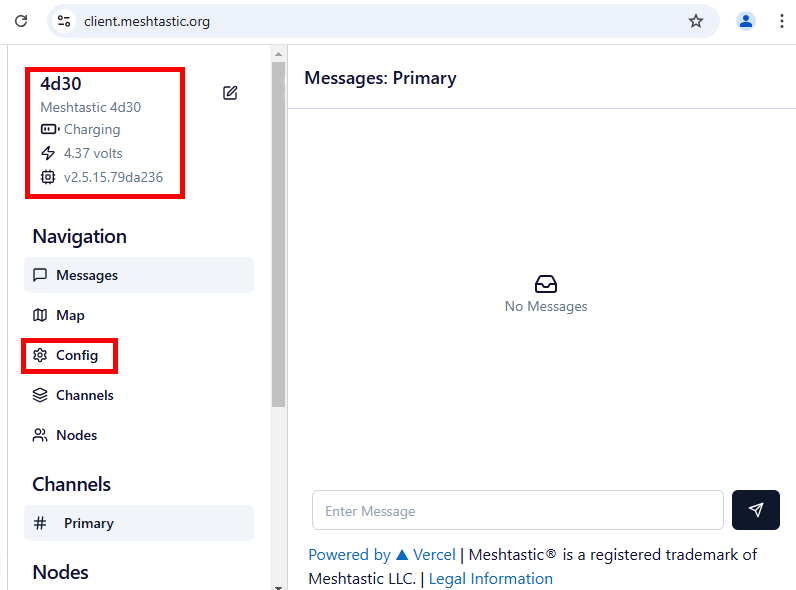</center> 

Click on _**Config**_ to start with the configuration of the device.    

----

### Set the LoRa configuration

#### Setup the Meshtastic Region

The first thing to setup is the Meshtastic Region. This is done in the _**LoRa**_ tab in the Web Client.

<center>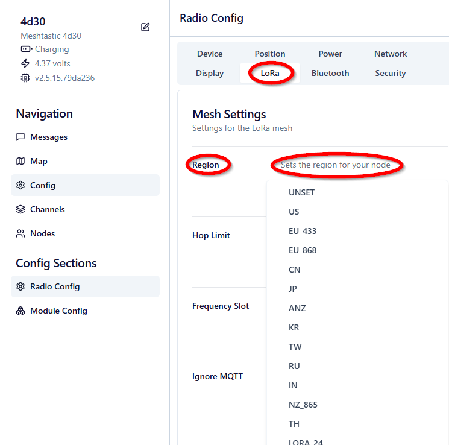</center>  

On a new device, it will show _**UNSET**_. On the drop-down selector you have to choose the correct Meshtastic region for your country.     

⚠️ It is necessary to select the correct Meshtastic Region, otherwise the WisMesh device will not be able to connect to other Meshtastic nodes! The region defines the basic LoRa frequency range the device will use to communicate.    

If you are unsure about the correct region for your country, you can find a list in the [Meshtastic documentation => Region](https://meshtastic.org/docs/configuration/radio/lora/#region)    

⚠️ The Web Client is not always updated to match with the latest Meshtastic firmware. E.g. in the Web Client used in this guide, the new Regions for the Philippines are missing. In case some settings are not available, you have to use the Python CLI to change these settings.

----

#### Setup the Frequency Slot and MQTT

In the same tab, is the _**Frequency Slot**_ selection.

⚠️ _For most users, the default Frequency Slot setting will work._     

And below is the control for the MQTT settings.

<center>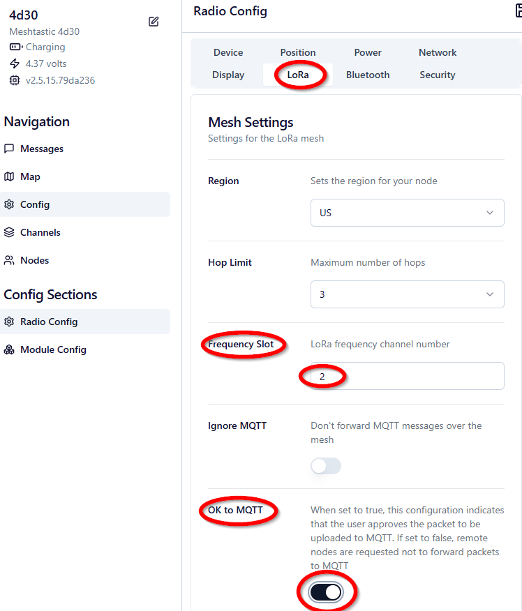</center>  

**Advanced user settings**    
If the devices messages and sensor data should be shared over a MQTT broker to the Cloud, it is important to enable _**OK to MQTT**_.    

Enabling _**Ignore MQTT**_ will ignore messages that are received from a MQTT broker.    
Enabling _**OK to MQTT**_ MUST be set, if the device's data should be sent to a MQTT broker. This is an important setting if e.g. sensor data or location data are shared with the Cloud for further processing.    

----

#### Setup the Modem Preset

After selecting the _**Meshtastic Region**_, the LoRa communication is preset to an default for this specific region.     

⚠️ _For most users, the default LoRa setting will work._     

The default setting can be changed under _**Waveform Settings**_ in the _**Modem Preset**_

<center>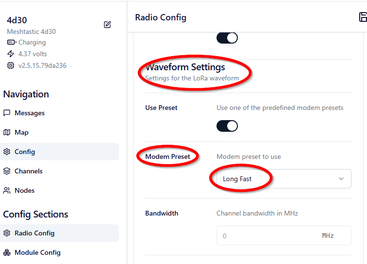</center>  

----

### Set the communication channel

The communication channel settings are in the _**Channels**_. 
The default primary channel for communication is preset in the device to _**LONGFAST**_. However, if you do not want to share your communication with all other Meshtastic devices, you can change it in the _**Name**_ setting and define your own communication channel.     

⚠️ _For most users, the default channel setting will work._     

<center>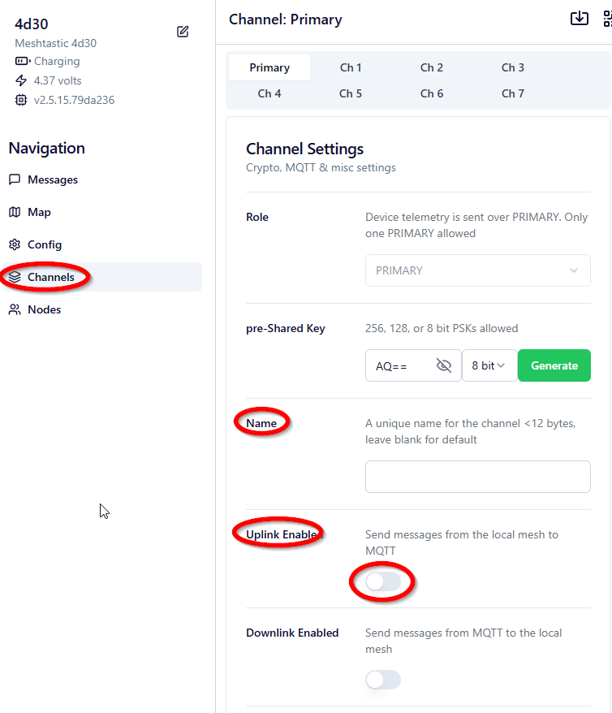</center>  

**Advanced user settings**    
If the devices messages and sensor data should be shared over a MQTT broker to the Cloud, it is important to check _**Uplink Enable**_.    
 
### Appendix Use Meshtastic Python CLI to change settings

⚠️ The Web Client is not always updated to match with the latest Meshtastic firmware. E.g. in the Web Client used in this guide, the new Regions for the Philippines are missing. In case some settings are not available, the Meshtastic Python CLI can be used to change these settings.

In this tutorial, the RAK11310 has to be set to Meshtastic Region Philippines 915 MHz, which is not (yet) listed in the Web Client.    
To change the device settings to use this specific region, the Meshtastic Python CLI is needed.    

First the Meshtastic Python CLI has to be installed as shown in the [Meshtastic Documentation](https://meshtastic.org/docs/software/python/cli/installation/).     

Once the Python CLI is installed, the required region can be setup with

```cli
python -m meshtastic --set lora.region 21
```

Every setting of the RAK11310 can be changed using the Meshtastic Python CLI. You can find a complete guide in the Meshtastic documentation in [Using the Meshtastic CLI](https://meshtastic.org/docs/software/python/cli/usage/)

----
----

## Meshtastic® is a registered trademark of Meshtastic LLC
#### [Legal Information](https://meshtastic.org/docs/legal)

----
----
