|  |  |  |    
| :-: | :-: | :-: |     

# WisMesh MQTT Gateway Setup Guide

This guide goes step by step through the setup of a WisMesh device as a gateway to a MQTT broker. It requires either     
- a RAK11200 (ESP32), combined with a RAK13300 LoRa module
- a RAK4631 (nRF52840), combined with a RAK13800 Ethernet module.     
- a RAK11310 (RP2040), combined with a RAK13800 Ethernet module.     

Optional the RAK13800 Ethernet module can be enhanced to use PoE with the RAK19018 PoE module.    

⚠️ The Meshtastic Mobile App used is the Android version. The steps will be similar when using the iOS version of the application, however the UI will be looking different.

⚠️ This guide requires that the Meshtastic Nodes are already setup to connect to the Meshtastic network.    
Detailed instructions for the setup can be found in the [WisMesh Basic Device Setup Guide](./WisMesh-Basic-Device-Setup-Guide.md).

Due to the different connectivity and required tools, this guide is divided into different sections:     
1) Setup a RAK4631 (nRF52840) module with the RAK13800 Ethernet module using the Meshtastic Mobile App over BLE
2) Setup a RAK11200 (ESP32) module using the Meshtastic Mobile App over BLE
3) Setup a RAK11310 (RP2040) module with the RAK13800 Ethernet module using the Meshtastic Web Client
4) Setup the MQTT settings using the Meshtastic Mobile App over BLE
5) Setup the MQTT settings using the Meshtastic Web Client

## Requirements
- RAK4631, RAK11200 or RAK11310 already setup as Meshtastic Node following the [WisMesh Basic Device Setup Guide](./WisMesh-Basic-Device-Setup-Guide.md).
- Meshtastic Mobile App installed on a Android mobile phone or an iOS device for RAk4631 and RAK11200
- Chrome browser to use the Meshtastic Web Client for RAK11310

## Setup a RAK4631 (nRF52840) module as Ethernet MQTT gateway

Once the RAK4631 is setup as a Meshtastic Node and has joined the network, there are only two steps required to forward data from the Meshtastic Network to an MQTT Broker.

### Enable Ethernet

In the Meshtastic Mobile App, open the _**Radio Configuration**_
To open the _**Radio Configuration**_ click on the three dots on the top right side. A menu will open, showing different options, including the _**Radio Configuration**_.      

  

In the following screen, select the _**Network**_ option

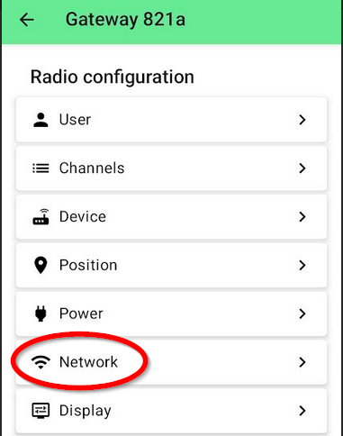
  

The _**Network Config**_ combines the options for both WiFi and Ethernet. For the combination of RAK4631 and RAK13800, the WiFi option must be kept disabled!     

To use the RAK13800, the Ethernet option must be enabled and the _**IPV4 mode**_ must be set. Optional a different _**NTP server**_ can be setup.

Using the **DHCP** option is the easiest way to connect the RAK13800 to an Ethernet connection. However, it is possible to use **STATIC** option to assign a static IP address to the device.    

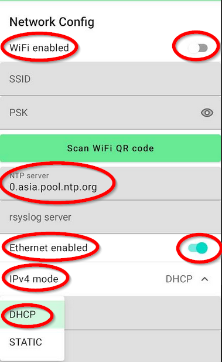
  

After sending the new setup to the device, it will reboot and connect over the Ethernet cable.     
Different to the RAK11200 with WiFi, the RAK4631 will still use BLE for the connection to the Meshtastic Mobile App.

If DHCP has been choosen, a network scanner app can help to find the IP address that was assigned to the WisMesh Ethernet Gateway. Alternative, the IP address will be shown in the debug output over the USB connection.

----

## Setup a RAK11200 (ESP32) module as WiFi MQTT gateway

Once the RAK4631 is setup as a Meshtastic Node and has joined the network, there are only two steps required to forward data from the Meshtastic Network to an MQTT Broker.

----

### Enable WiFi

Goto to the _**Radio Configuration**_.    
To open the _**Radio Configuration**_ click on the three dots on the top right side. A menu will open, showing different options, including the _**Radio Configuration**_.      

  

In the different options showing in the _**Radio Configuration**_ choose _**Network**_

  

The _**Network Config**_ is for both WiFi and a wired connection through Ethernet. Enable WiFi and keep Ethernet disabled.    

Then enter the WiFi SSID that should be used and the WiFi PSK for this WiFi Network. Optional (if available), you can scan a QR code with the WiFi credentials.    

  

⚠️ The settings for the NTP server (Network Time Provider) are optional. You can use the default **meshtastic.pool.ntp.org** or choose one that works better for your country.

Once the Meshtastic node is connected to the WiFi network, the BLE connection to the Meshtastic Mobile App is no longer available. 

# ⚠️ WARNING
_**If you configure the device for a WiFi network that you cannot access from your phone, e.g. an isolated guest access point on your router, you cannot access the device anymore. The only way to recover the device is to do a factory reset by reflashing the Meshtastic firmware**_

----

## Setup a RAK11310 (RP2040) module as Ethernet MQTT gateway

The Raspberry RP2040 MCU on the RAK11310 does not have WiFi nor BLE connectivity. The only way to setup the device is through the Web Client.    

# ⚠️ WARNING
_**At the time of publishing this guide, the default Meshtastic firmware did not support the RAK13800. A merge request to [Add Ethernet RAk13800 support to RAk11310](https://github.com/meshtastic/firmware/pull/5707) was issued.**_    

----

### Connect the device over USB to your computer

It is not easy to determine the USB port the RAK11310 will use. As best practice disconnect all other devices that would show as USB port on the computer.

----

### Connect the device to the Web Client

⚠️ The Web Client using Web Serial API is only supported by a few browser. You can find the list of supported browsers in the Meshtastic documentation for the [Web Client](https://meshtastic.org/docs/software/web-client/#serial-usb).     

We are using the Chrome browser and the hosted version of the Web Client in the setup of the RAK11310 Meshtastic node.    

----

#### Open the Web Client
In the Chrome browser, open [_**`https://client.meshtastic.org/`**_](https://client.meshtastic.org/) to start the Web Client. In the start screen it will show that no devices are connected.

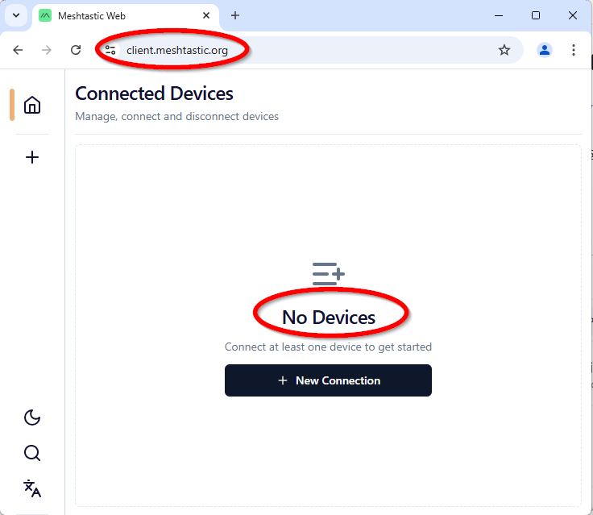
 

Click on _**New Connection**_ to setup the USB connection to the RAK11310. In the new window, select _**Serial**_ as connection method.    
Depending on the connected devices, you will see a list of devices. Select the device that is the RAK11310.     

⚠️ It is not easy to determine the USB port the RAK11310 will use. As best practice disconnect all other devices that would show as USB port on the computer.    

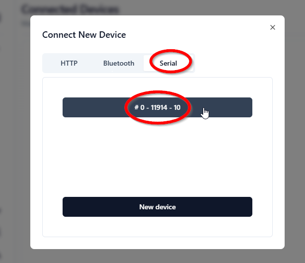
 

If the correct USB port is selected, the Web Client screen will show some first information about the device like
- Device name
- Battery status
- Meshtastic firmware version

 

Select _**Config**_, then _**Radio Config**_ and open the _**Network**_ tab.

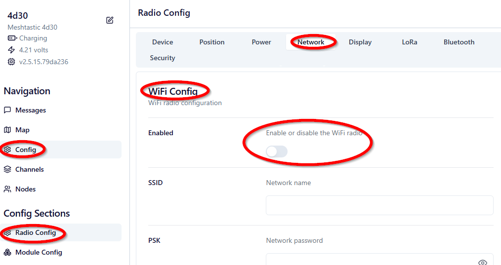
 

Make sure that in the _**WiFi Config**_ WiFi is disabled!

Then scroll down to the _**IP Config**_ settings.

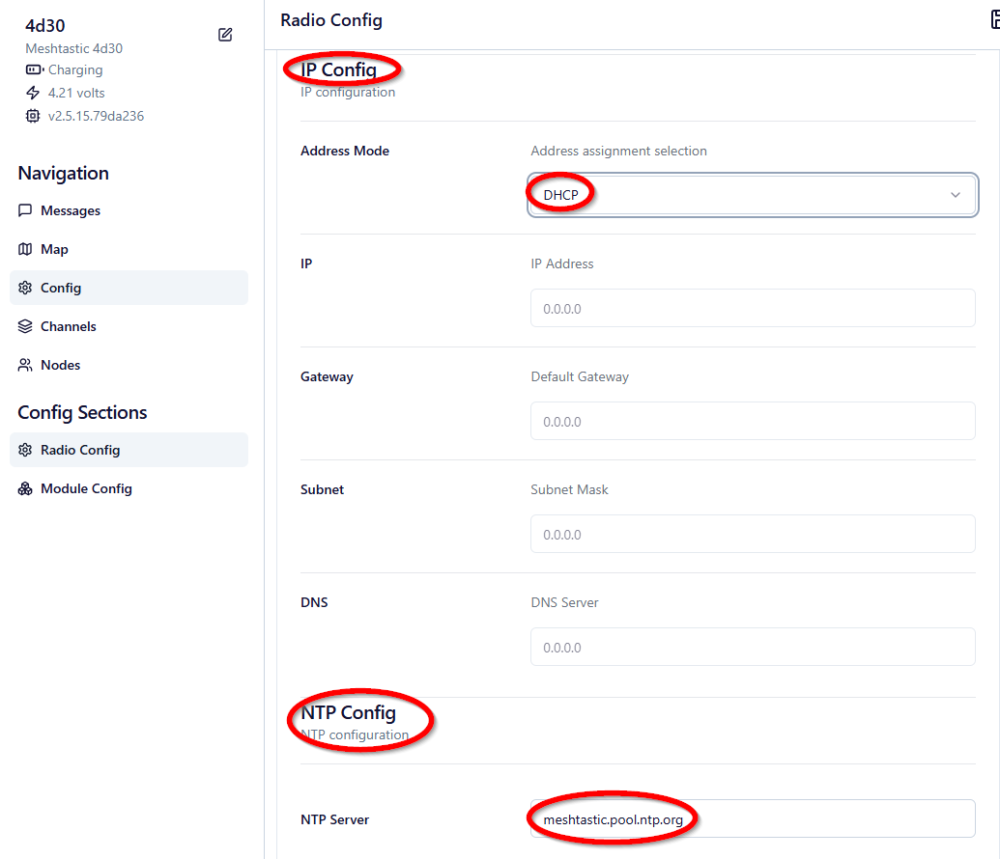
 

To use the RAK13800, the Ethernet option must be enabled and the _**IPV4 mode**_ must be set. Optional a different _**NTP server**_ can be setup.

Using the **DHCP** option is the easiest way to connect the RAK13800 to an Ethernet connection. However, it is possible to use **STATIC** option to assign a static IP address to the device.    

After sending the new setup to the device, it will reboot and connect over the Ethernet cable.     

If DHCP has been choosen, a network scanner app can help to find the IP address that was assigned to the WisMesh Ethernet Gateway. Alternative, the IP address will be shown in the debug output over the USB connection.

----

## Setup the connection to the MQTT Broker using the Meshtastic Mobile App

⚠️ Setting the MQTT broker connection with the Meshtastic Mobile App works only with the RAK4631 and the RAK11200. For the RAK11310, refer to [Setup the connection to the MQTT Broker using the Meshtastic Web Client](#setup-the-connection-to-the-mqtt-broker-using-the-meshtastic-web-client)

In the Meshtastic Mobile App, open the _**Radio Configuration**_
To open the _**Radio Configuration**_ click on the three dots on the top right side. A menu will open, showing different options, including the _**Radio Configuration**_.      

  

Scroll down, until the _**Module Configuration**_ are visible and select the _**MQTT**_ entry.

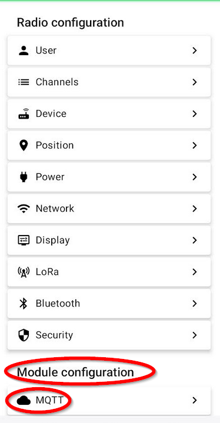
  

First, _**MQTT enabled**_ has to be checked.    

Any MQTT broker can be setup here. Depending on the broker, the settings will be different.    

The easiest option to start with is the free MQTT broker provided by Meshtastic. You can find the URL, address, username and password in the [Meshtastic documentation](https://meshtastic.org/docs).        

Depending on the way the data is processed after the MQTT broker, the data can be sent encrypted by checking _**Encryption enabled**_. In that case you need a data processing function that can decrypt the packets.    

The data format can be choosen as well. If _**JSON output enabled**_ is checked, the data will be sent in an easy to read JSON formatted packet. Otherwise the raw payload will be sent as a byte array.    

To avoid too much traffic, it is suggested to use a custom root topic. If the default topic is used, it is more difficult to filter out the packets.     

If it is desired to see the devices on the public Meshtastic maps, e.g. [MeshMap.net](https://meshmap.net/), the Map reporting has to be enabled and a reporting time has to be set.    

⚠️ [MeshMap.net](https://meshmap.net/) expects that the data is coming from the free Meshtastic MQTT broker!

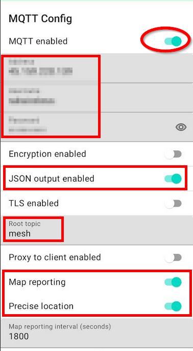
  

Here we chose a "private" MQTT broker, unencrypted packets in JSON format and use _**mesh**_ as the root topic.    

An alternative setup using the free Meshtastic MQTT broker would look like this:

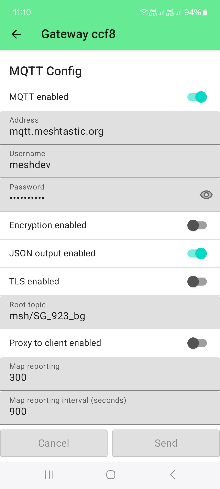

----

## Setup the connection to the MQTT Broker using the Meshtastic Web Client

Connect the device to the Meshtastic Web Client as shown in [Setup a RAK11310 (RP2040) module as Ethernet MQTT gateway](#setup-a-rak11310-rp2040-module-as-ethernet-mqtt-gateway)

Once the device is connected, goto _**Config**_, _**Module Config**_ and open the _**MQTT**_ tab.

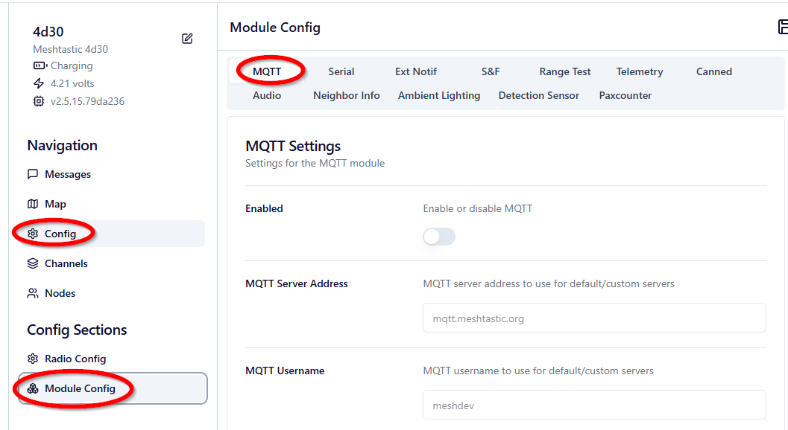
  

First, _**MQTT enabled**_ has to be checked.    

Any MQTT broker can be setup here. Depending on the broker, the settings will be different.    

The easiest option to start with is the free MQTT broker provided by Meshtastic. You can find the URL, address, username and password in the [Meshtastic documentation](https://meshtastic.org/docs).        

Depending on the way the data is processed after the MQTT broker, the data can be sent encrypted by checking _**Encryption enabled**_. In that case you need a data processing function that can decrypt the packets.    

The data format can be choosen as well. If _**JSON output enabled**_ is checked, the data will be sent in an easy to read JSON formatted packet. Otherwise the raw payload will be sent as a byte array.    

To avoid too much traffic, it is suggested to use a custom root topic. If the default topic is used, it is more difficult to filter out the packets.     

If it is desired to see the devices on the public Meshtastic maps, e.g. [MeshMap.net](https://meshmap.net/), the Map reporting has to be enabled and a reporting time has to be set.    

Here we left all settings to the default, using the free Meshtastic MQTT Broker and the default root topic.

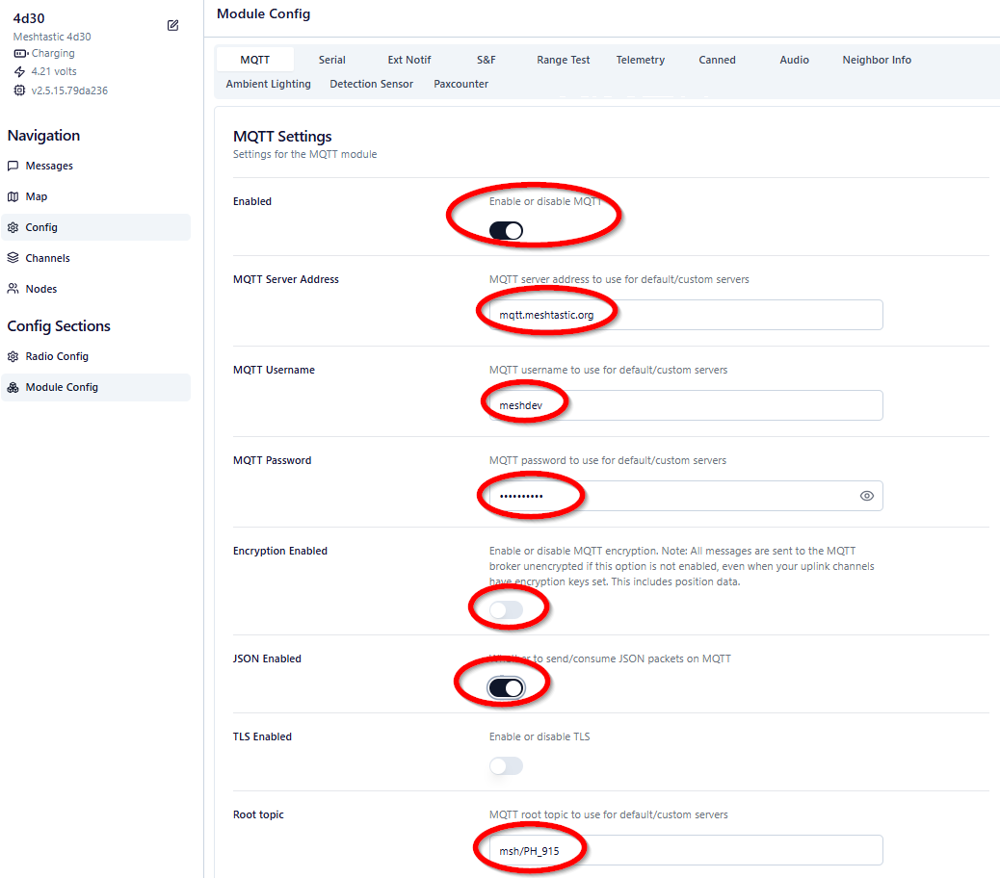
  

----
----

## Meshtastic® is a registered trademark of Meshtastic LLC
#### [Legal Information](https://meshtastic.org/docs/legal)

----
----
